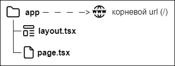

# Установка

[Оригинал статьи](https://nextjs.org/docs/getting-started/installation)

Актуальность: 10.03.2024

---


Системные требования:

* Node.js 18.17 или более поздняя версия.
* Операционные системы macOS, Windows (включая WSL) и Linux.

# Автоматическая установка

Мы рекомендуем устанавливать новое приложение Next.js с помощью `create-next-app`, который автоматически все настроит для вас. Чтобы создать проект, выполните команду:

```terminal
npx create-next-app@latest
```

При установке вы увидите следующие подсказки:

```terminal
What is your project named? my-app
Would you like to use TypeScript? No / Yes
Would you like to use ESLint? No / Yes
Would you like to use Tailwind CSS? No / Yes
Would you like to use `src/` directory? No / Yes
Would you like to use App Router? (recommended) No / Yes
Would you like to customize the default import alias (@/*)? No / Yes
What import alias would you like configured? @/*
```

После подсказок `create-next-app` создаст папку с именем вашего проекта и установит необходимые зависимости.

# Ручная установка

Чтобы вручную создать новое приложение Next.js, установите необходимые пакеты:

```terminal
npm install next@latest react@latest react-dom@latest
```

Откройте файл `package.json` и добавьте следующие скрипты:

```json
{
  "scripts": {
    "dev": "next dev",
    "build": "next build",
    "start": "next start",
    "lint": "next lint"
  }
}
```

Эти сценарии относятся к различным этапам разработки приложения:

**dev**: выполняет `next dev` для запуска Next.js в режиме разработки.
**build**: выполняет `next build` для сборки приложения для использования в продакшен.
**start**: выполняет `next start` для запуска продакшен сервера Next.js.
**lint**: выполняет `next lint` для проверки соответствия стиля написания кода указанной в Next.js конфигурации ESLint.

## Создание директорий

Next.js использует маршрутизацию файловой системы, что означает, что маршруты в вашем приложении определяются тем, как вы структурируете свои файлы и папки.

### Директория app

Для новых приложений мы рекомендуем использовать `App Router`. Этот маршрутизатор позволяет использовать новейшие возможности React и является эволюцией `Pages Router`, основанной на отзывах сообщества.

Создайте папку `app/`, затем добавьте в нее файлы `layout.tsx` и `page.tsx`. Они будут отображаться при посещении пользователем корня вашего приложения (/).



Создайте корневой макет в файле `app/layout.tsx` с необходимыми тегами `<head>` и `<body>`:

```js
export default function RootLayout(
  {children}: {children: React.ReactNode}
) {
  return (
    <html lang="en">
      <body>{children}</body>
    </html>
  )
}
```

Наконец, создайте домашнюю страницу `app/page.tsx` с начальным содержимым:

```js
export default function Page() {
  return <h1>Hello, Next.js!</h1>
}
```

Полезно знать: Если вы забудете создать `layout.tsx`, Next.js автоматически создаст этот файл при запуске сервера разработки с `next dev`.

### Директория public (необязательно)

Создайте папку `public` для хранения статических файлов ресурсов, таких как изображения, шрифты и т.д. На файлы в общей папке можно будет ссылаться в коде, начиная с базового URL (/).

# Запуск сервера разработки

Для запуска сервера разработки выполните следующие действия:

1. в консоли терминала выполните команду `npm run dev`, чтобы запустить сервер разработки.
2. Зайдите на сайт `http://localhost:3000`, чтобы увидеть работу своего приложения.
3. Отредактируйте файл `app/page.tsx` и сохраните изменения, чтобы увидеть обновленный результат в браузере.
